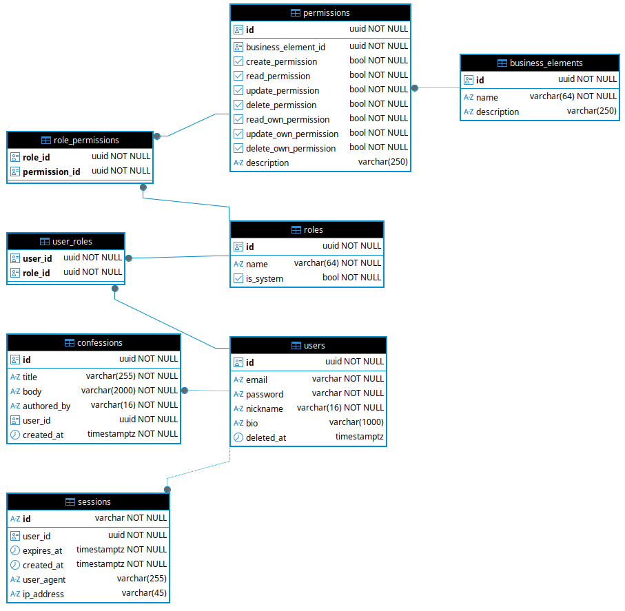

# it-anon-confession

Демонстрационный проект backend-сервера платформы анонимных (шуточных) признаний IT-специалистов, реализованный с использованием фреймворка FastAPI.

## Основные возможности

* **Аутентификация:** Сессионная, с передачей session ID через HttpOnly cookie.
* **Авторизация:** На основе RBAC-модели (роли и разрешения).
* **Управление признаниями:** CRUD-операции для анонимных записей (создание, чтение, обновление, удаление).
* **Админ-панель:** Инструменты для управления пользователями, ролями и мониторинга разрешений.
* **Безопасность:** Валидация входных данных, sanitization HTML, хеширование паролей (bcrypt), настройка CORS.
* **Дополнительно:** Пагинация списков, мягкое удаление пользователей.

## Технологический стек

* **Фреймворк:** FastAPI
* **База данных:** PostgreSQL + SQLAlchemy 2.0 (Async)
* **Миграции:** Alembic
* **Валидация:** Pydantic v2
* **Тестирование:** pytest + coverage
* **Логирование:** logging
* **Пакетный менеджер:** UV
* **Контейнеризация:** Docker + Docker Compose
* **Дополнительные средства:**
  * форматирование кода: Black + isort
  * статический анализ типов: MyPy

## Установка и запуск

### Требования

* Docker и Docker Compose
* UV
* Python 3.13+ (если запуск локально)

### Быстрый старт (Docker)

1. Настройте окружение (опционально):

    ```bash
    cp example.env .env
    ```

2. Запустите проект:

    ```bash
    docker-compose up -d
    ```

3. API будет доступно по адресу: `http://localhost:8000`
4. Документация Swagger: `http://localhost:8000/docs`

### Локальная разработка

1. Установите пакетный менеджер UV:

    ```bash
    curl -LsSf https://astral.sh/uv/install.sh | sh
    ```

2. Установите зависимости:

    ```bash
    uv sync
    ```

3. Запустите PostgreSQL (например, через Docker)
4. Примените миграции: `prestart.sh`
  или

   ```bash
   alembic upgrade head
   ```

5. Запустите сервер:

    ```bash
    uvicorn src.main:app --reload
    ```

### Тестирование

Команда для запуска тестов:

  ```bash
  uv run pytest .
  ```

## Краткое описание API

### Аутентификация (/auth)

Все запросы, кроме регистрации и входа, требуют наличия куки `session_id`.

* **POST** `/auth/register` — Регистрация нового аккаунта
* **POST** `/auth/login` — Вход в систему (устанавливает HttpOnly куку)  
* **POST** `/auth/logout` — Завершение сессии и удаление куки  

### Пользователи (/users)

* **GET** `/users/{identifier}` — Получение профиля (по UUID или Email)  
* **PATCH** `/users/{user_id}` — Частичное обновление данных (nickname, bio, email)  
* **POST** `/users/me/change-password` — Смена пароля (требует старый пароль)  
* **DELETE** `/users/me` — Удаление собственного аккаунта ("мягкое" удаление)  

### Признания (/confessions)

* **POST** `/confessions/` — Создать новое анонимное признание  
* **GET** `/confessions/` — Список всех признаний
* **GET** `/confessions/{confession_id}` — Детали конкретного признания  
* **PATCH** `/confessions/{confession_id}` — Редактирование заголовка и текста
* **DELETE** `/confessions/{confession_id}` — Удаление признания  

### Администрирование (/admin)

Требуется соответствующие разрешения на бизнес-элемент `admin`.

#### Управление пользователями

* **GET** `/admin/users/` — Список всех зарегистрированных пользователей  
* **DELETE** `/admin/users/{user_id}` — Удаление пользователя  
* **GET** `/admin/users/{user_id}/permissions` — Просмотр всех прав пользователя  
* **POST** `/admin/users/{user_id}/assign-role/{role_id}` — Назначить роль пользователю  
* **POST** `/admin/users/{user_id}/revoke-role/{role_id}` — Отозвать роль у пользователя  

#### Управление ролями и правами

* **GET** `/admin/roles/` — Список всех ролей  
* **POST** `/admin/roles/` — Создание новой роли  
* **PATCH** `/admin/roles/{role_id}` — Переименование роли (кроме системных)  
* **DELETE** `/admin/roles/{role_id}` — Удаление роли (кроме системных)
* **POST** `/admin/roles/{role_id}/assign-permission/{permission_id}` — Назначить разрешение роли  
* **POST** `/admin/roles/{role_id}/revoke-permission/{permission_id}` — Убрать разрешение у роли  
* **GET** `/admin/permissions/` — Список всех разрешений системы  
* **GET** `/admin/business-elements/` — Список бизнес-элементов системы  

### Типовые коды ошибок

* **400 CONFLICT** — Некорректный запрос.
* **401 UNAUTHORIZED** — Сессия отсутствует, истекла или невалидна.
* **403 FORBIDDEN** — Недостаточно прав для выполнения операции (например, доступ обычного пользователя к `/admin`, либо попытка удалить последнего администратора).
* **409 CONFLICT** — Конфликт состояния ресурса (например, регистрация с уже существующим email).
* **422 UNPROCESSABLE ENTITY** — Ошибка валидации данных  

## Данные по умолчанию

По умолчанию в системе создаются:

* роли `admin` и `user`
* пользовали:
  * администратор `admin` (`admin@example.com` / `admin123`) с ролью `admin`
  * обычные пользователи `python_fan` (`python_fan@example.com` / `admin123`) и `bug_hunter` (`bug_hunter@example.com` / `admin123`) с ролью `user`
* набор прав доступа:
  * роль `admin` — полный доступ
  * роль `user` — доступ только к своим ресурсам, доступ к просмотру признаний
* 4 признания от пользователей

Ограничения:

* Последний администратор в системе не может быть удалён или снят
* Системные роли `admin` и `user` не могут быть удалены / изменены

## Структура проекта

Структура проекта с описанием основных элементов:

```text
.              
├── prestart.sh               # Скрипт запуска миграций
├── pyproject.toml            # Зависимости и настройки проекта (UV)
├── migrations/               # Миграции (Alembic)
├── src                       # Основной исходный код приложения
│   ├── api                   # Слой API
│   │   └── http
│   │       ├── common_exceptions.py  # Общие HTTP-ошибки
│   │       ├── dto/                  # DTO для API слоя
│   │       ├── endpoints             # HTTP-эндпоинты
│   │       │   ├── admin/            # Администрирование
│   │       │   ├── auth.py           # Аутентификация, регистрация
│   │       │   ├── confessions.py    # Работа с confessions
│   │       │   └── users.py          # Работа с пользователями
│   │       ├── middleware/           # Middleware
│   │       ├── response_models.py    # Модели ответов API
│   │       └── routes.py             # Регистрация маршрутов
│   ├── core                 # Общие настройки и инфраструктурные зависимости
│   │   ├── config.py        # Конфигурация приложения
│   │   ├── dependencies.py  # DI
│   │   └── security.py      # Утилиты безопасности
│   ├── domain               # Домен
│   │   ├── dto/             # DTO доменного уровня
│   │   ├── entities/        # Сущности (бизнес-модели)
│   │   ├── enums/           # Перечисления
│   │   ├── errors.py        # Доменные ошибки
│   │   ├── interfaces/      # Интерфейсы (репозитории, UoW)
│   │   │   └── database
│   │   │       ├── *_repo.py    # Контракты репозиториев
│   │   │       ├── filters/     # Фильтры для запросов
│   │   │       └── uow.py       # Unit of Work интерфейс
│   │   └── validators.py    # Валидация бизнес-логики
│   ├── infrastructure       # Реализация инфраструктуры
│   │   └── postgres
│   │       ├── db.py         # Подключение к PostgreSQL
│   │       ├── models/       # ORM модели (SQLAlchemy)
│   │       ├── repositories/ # Реализация репозиториев
│   │       └── uow.py        # Реализация Unit of Work
│   ├── libs                  # Вспомогательные библиотеки
│   │   └── logger/           # Кастомный логгер
│   ├── main.py               # Точка входа
│   └── services/             # Use cases / бизнес-логика
└── tests/                    # Тесты
```

## Схема базы данных



## Примеры запросов

### Регистрация

  Запрос:

  ```bash
  curl -X POST http://localhost:8000/auth/register \
      -H "Content-Type: application/json" \
      -d '{
        "email": "bug_hunter@example.com",
        "password": "strong_password_123",
        "password_repeat": "strong_password_123",
        "nickname": "bug_hunter",
        "bio": "I write bugs for food"
      }'
  ```

  Ответ (201 Created):

  ```bash
  {
    "message": "User has been registered"
  }
  ```

### Признания

  Запрос:

  ```bash
  curl -X POST http://localhost:8000/confessions/ \
      --cookie "session_id=<your_session_token>" \
      -H "Content-Type: application/json" \
      -d '{
        "title": "Prod Disaster",
        "body": "I accidentally dropped the production database on Friday evening."
      }'
  ```

  Ответ (200 OK):

  ```json
  {
    "data": {
      "id": "019ca1e5-c378-7000-8000-000000000405",
      "title": "Prod Disaster",
      "body": "I accidentally dropped the production database on Friday evening.",
      "authored_by": "bug_hunter",
      "created_at": "2026-04-23T14:20:00Z"
    }
  }
  ```

### Пользователи

  Запрос:

  ```bash
  curl -X GET http://localhost:8000/users/019ca1e5-c378-7000-8000-000000000201 \
      --cookie "session_id=<your_session_token>"
  ```

  Ответ (200 OK):

  ```json
  {
    "data": {
      "id": "019ca1e5-c378-7000-8000-000000000201",
      "email": "admin@example.com",
      "nickname": "admin",
      "bio": "Administrator"
    }
  }
  ```

  Ошибка (403 FORBIDDEN):

  ```json
  {
    "detail": {
      "code": "FORBIDDEN",
      "message": "Access denied"
    }
  }
  ```
